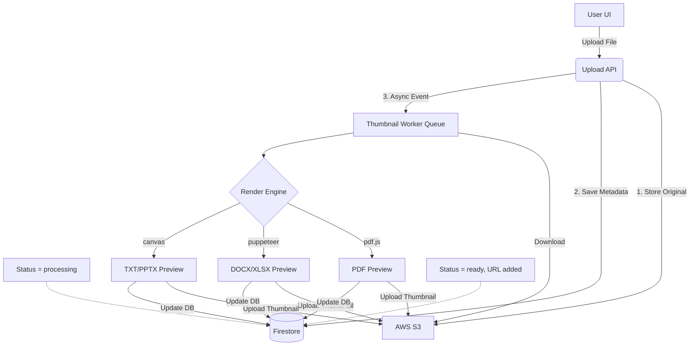

# 🖼️ Google Drive–Style Thumbnail System For CloudSpace

## 🏗️ Architecture & Data Flow



### Components
1. **Upload Flow (API)**: Uploads original file to S3, initialize DB record with `thumbnailStatus="processing"` and puts message in worker queue.
2. **Worker Pool (Background)**: The queue spins up a worker to process thumbnails. Download file to memory/disk, pick appropriate rendering engine (Puppeteer, Canvas, Poppler, etc.), upload the resulting image to S3.
3. **Database (Firestore)**: Tracks document metadata updates. Thumbnail generation is decoupled so UI doesn't freeze. Updates `thumbnailStatus` to `"ready"`, setting `thumbnailUrl`.
4. **Angular Frontend**: Grid component is reactive. If `thumbnailStatus === processing`, shows the spinning skeleton animation. If `thumbnailStatus === ready`, directly render ``.

---

## 🛠️ Step-by-Step Implementation Plan (Completed)

1. **Backend Database Model**
   - Modified `saveDocument` in `firestore.service.js`.
   - Setup default property `thumbnailStatus`, defaulting to `'processing'`.
   
2. **Background Worker**
   - Modified `thumbnail-queue.service.js`.
   - On processing completion, update Firestore setting `thumbnailStatus: 'ready'` alongside `thumbnailUrl`.
   - On error, update Firestore setting `thumbnailStatus: 'failed'`.
   
3. **Frontend Data Module**
   - Updated Angular `CloudFile` interface to incorporate `thumbnailStatus: 'processing' | 'ready' | 'failed'`. 

4. **Frontend UI Rendering**
   - Refactored `documents.component.ts` Grid HTML logic.
   - Using TailwindCSS `relative`, `absolute inset-0`, added a visually pleasing skeleton using standard grid overlay.
   - Conditionally render SVGs if unavailable, Skeleton loop if `processing`, and lazy-loaded `` if `ready`. Add an error handler binding on image `(error)` so broken URLs render a generic icon instead of blank spacing.

---

## 📚 Edge Case Handling & Caching

1. **Password-protected or Corrupted PDFs**: The rendering engine catches errors inside `render.service.js` which drops to a standard icon generation and sets `thumbnailStatus` as "failed".
2. **Very Large PDFs**: Puppeteer renderer bounds width/height properly and timeout limits in queue queue.service (`JOB_TIMEOUT: 60000`) forcefully terminate jobs. Memory is constrained using bounds.
3. **Shared Files**: Thumbnails are retrieved from `/api/secure/documents/...` or S3 directly with signed URLs (1 hour timeout). Because auth intercepts the backend controller for signed URLs and the thumbnails sit alongside file scopes, users cannot guess thumbnail URLs.
4. **Performance Headers**: Generated images are stored in S3 Cache Headers with short/long expiry configuration. They are typically no larger than `50–120KB` (sized down via `THUMBNAIL_WIDTH = 400`).

---

## ✅ Checklist for Testing

### 1. Unit Tests
- [ ] Ensure `firesore.service.saveDocument()` defaults to updating `thumbnailStatus="processing"`.
- [ ] Mock queue processing step and assert `thumbnailStatus="ready"` and `thumbnailUrl` string.
- [ ] Unit test Angular mapping `CloudFile` object `thumbnailStatus` bindings.

### 2. Integration Tests
- [ ] **Upload API**: Provide a mock pdf, assert 201 response. Verify DB object instantly changes `status` and `thumbnailStatus`.
- [ ] **Worker integration check**: Run queue locally. It should pick up the pdf, log `Rendering PDF first page...` and push image back to DB/S3 within 10 bounds.
- [ ] **Frontend**: Load grid. Wait 2 seconds. The processing loader skeleton should visually replace with the document preview image.

### 3. Manual Testing
- [ ] Upload a standard text file. Verify it shows grid view and "Processing...".
- [ ] Hard-refresh page after 30 seconds. Verify the text snippet preview is displayed.
- [ ] Replicate with a `.docx` document and a `.xlsx` spreadsheet. Wait for the respective puppeteer screenshots to output to the Grid UI.
- [ ] Validate sharing with another account and check if thumbnail is presented in their "Shared with me" route.
- [ ] Attempt upload of an unsupported file (e.g. unknown `dat` file). Look for error handling, DB status `thumbnailStatus="failed"`, and UI defaulting to standard icon.

---

## 🔍 Root Cause Analysis: Why Thumbnails Initially Failed to Show

1. **S3 Bucket Privacy (403 Forbidden):** The S3 bucket `docvault-dev-docs` is correctly configured as restricted/private. However, the background worker was previously saving raw, unsigned S3 URLs directly into the database as `previewUrl`. When the Angular frontend `` attempted to load these links, AWS immediately blocked the request because standard `` tags cannot natively pass Firebase Authentication headers.
2. **Angular Fallback Trigger:** Because AWS responded with `403 Forbidden`, the `` tag emitted an `(error)` event. The Angular frontend caught this via `(error)="handleThumbnailError($event, doc)"`, which immediately flipped `doc.thumbnailStatus = 'failed'`, hiding the image and falling back to the generic file-type SVGs.
3. **The Current Fix (Secure):** We implemented **Auto-signed URLs** on the backend (`getDownloadUrl()`). Whenever the frontend requests the document list or a specific document, the backend dynamically maps the internal database path into a 1-hour secure **Presigned S3 URL**. These presigned URLs contain AWS-signed query parameters that bypass the bucket's strict privacy rules exclusively for that strict timeframe, natively rendering inside Angular without leaking the bucket!
4. **Alternative Implementation (Public Bucket):** If you prefer to change the AWS S3 bucket configuration instead of generating backend signatures, you must do **two things** in AWS S3:
   * **Bucket Policy:** Turn off "Block all public access" and apply a PublicRead policy to `docvault-dev-docs/thumbnails/*`.
   * **CORS Configuration:** S3 buckets natively block Cross-Origin requests from domains like `localhost:4200`. You must go to the **Permissions** tab -> **Cross-origin resource sharing (CORS)** and add the following JSON format:
```json
[
    {
        "AllowedHeaders": ["*"],
        "AllowedMethods": ["GET", "HEAD"],
        "AllowedOrigins": ["*"],
        "ExposeHeaders": []
    }
]
```
   *(Without the CORS rule, your backend Node server can fetch the thumbnail perfectly fine, but the browser running Angular will still throw a hidden CORS Error and hide the thumbnail!)*
5. **Cached Node/Angular States:** Remember that old cached 403 Forbidden responses stay within browser memory for a few minutes. We updated the backend to add `?cb=` cache-busters to bypass this caching entirely.
